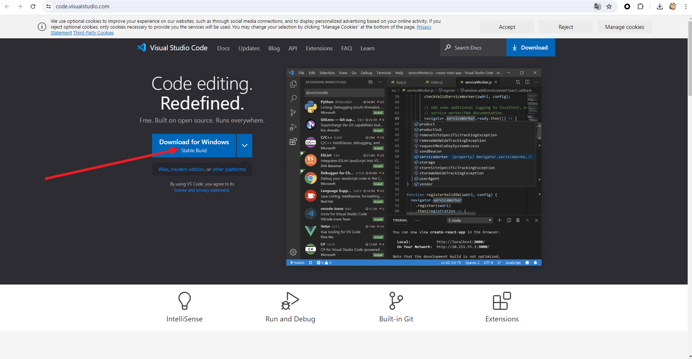
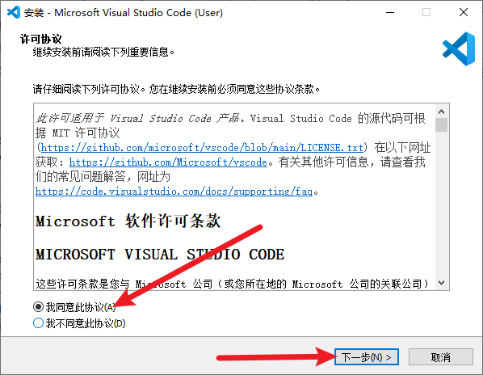
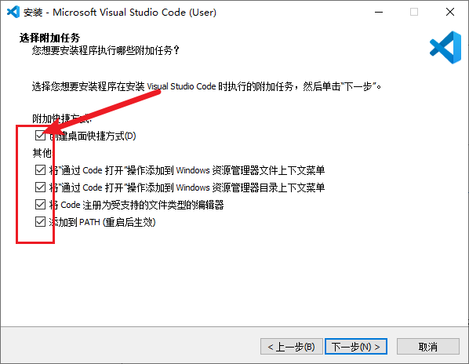
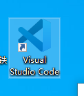
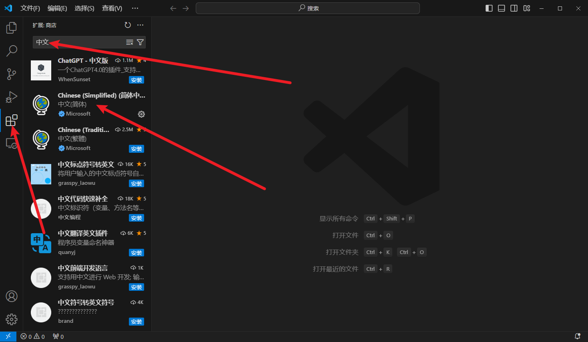
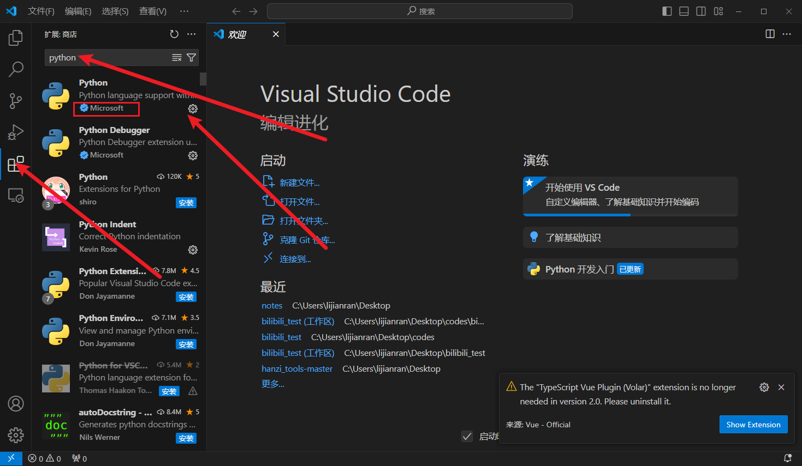
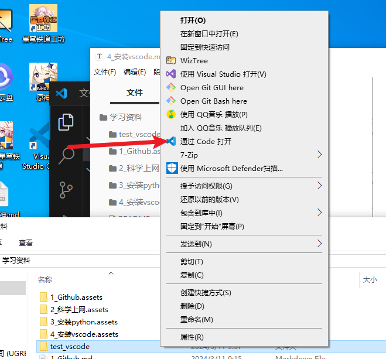
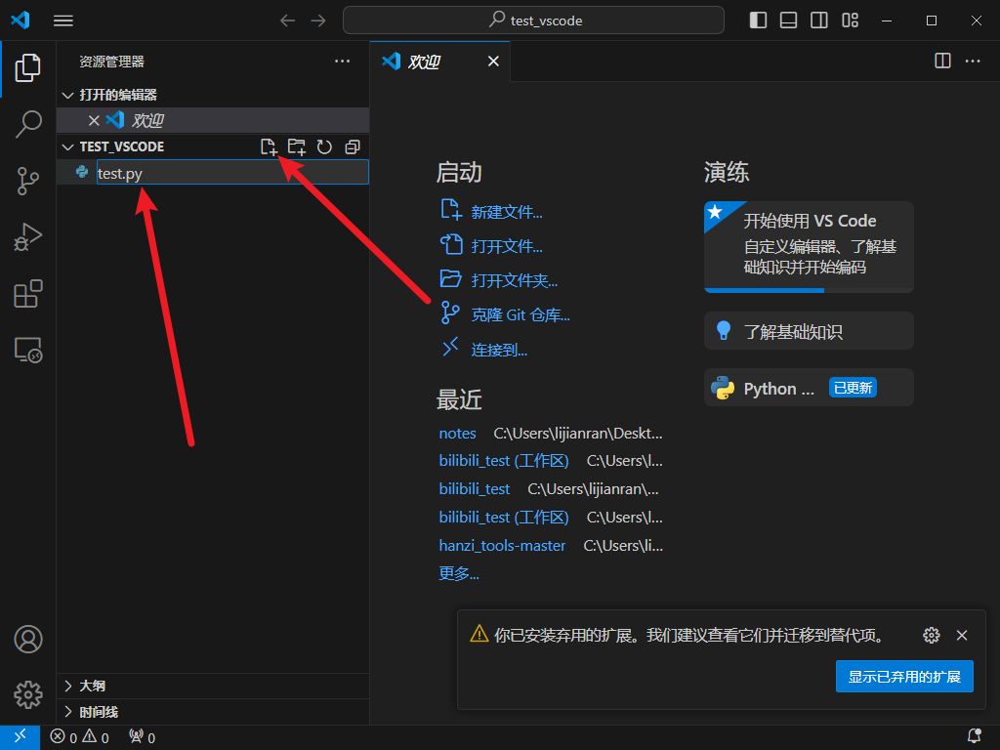
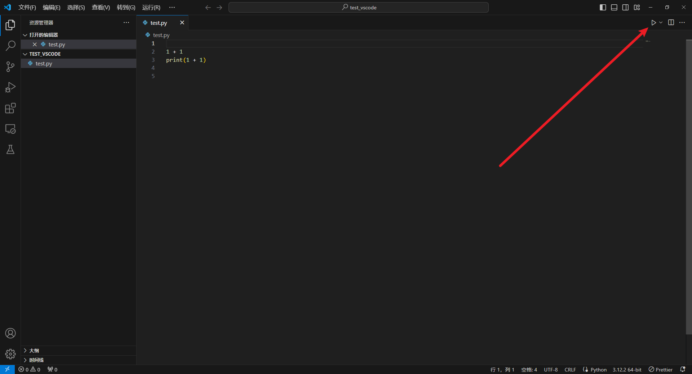

# 安装 VSCode

- 搜索 vscode 官网

https://code.visualstudio.com/

- 双击安装

`VSCodeUserSetup-x64-1.87.1.exe`

- 使用方法、

桌面双击：

安装中文版：

安装 python 插件：

- 打开文件夹

- 新建 python 代码文件

**注意 test.py 以 .py 结尾，有个点号**

- 运行python代码

