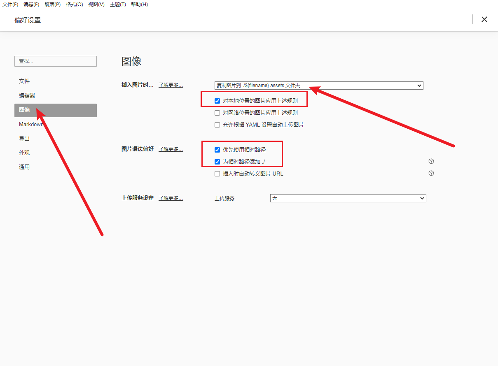

# markdown 语法

- 教程

https://markdown.com.cn/basic-syntax/

## 语法学习

### 1. 标题 (重要)

输入 # + 空格 一级标题

输入 ## + 空格 二级标题

以此类推

#### 这是四级标题

### 2. 段落 (重要)

记得空一行，这是一个好习惯

### 3. 加粗 (重要)

今天来**学习markdown**

### 4. 引用

语法是大于号 > 加上 空格 回车即可

> 这是一段引用  from https://markdown.com.cn/basic-syntax/
>
> Markdown是一种轻量级标记语言，排版语法简洁，让人们更多地关注内容本身而非排版。它使用易读易写的纯文本格式编写文档，可与HTML混编，可导出 HTML、PDF 以及本身的 .md 格式的文件。因简洁、高效、易读、易写，Markdown被大量使用，如Github、Wikipedia、简书等。
>
> 在线体验一下 [Markdown在线编辑器](https://markdown.com.cn/editor/)。
>
> 千万不要被「标记」、「语言」吓到，Markdown的语法十分简单，常用的标记符号不超过十个，用于日常写作记录绰绰有余，不到半小时就能完全掌握。
>
> 就是这十个不到的标记符号，却能让人**优雅地沉浸式记录，专注内容而不是纠结排版**，达到「心中无尘，码字入神」的境界。
>
> 让我们从 [Markdown 标题语法](https://markdown.com.cn/basic-syntax/headings.html)开始学习吧。

### 5. 列表 (重要)

一）第一种小圆点 直接 减号 - 加上一个空格

- 这是小圆点列表
- 我来学习列表

二）第二种是序号

1. 这是第一项
2. 这是第二项
3. 第三

三）第三种 嵌套列表

- 一级
  - 二级
    - 三级
    - 3.2

1. 一级
   1. 这是 1.1
   2. 这是 2.2
      1. 这是 2.2.1

- 1 测试
  - 1.1 测试
  - 1.2 测试
    - 1.2.1 测试

四）代办事项

[ X ] test

- [x] 待办事项1

- [x] 待办事项2

- [ ] 待办事项3

- [ ] 待办事项4


### 6. 代码 (重要)

- 第一种

this is code 1

使用 两个 小撇 ` 包裹代码

`this is code 1`

`这是代码`

`code`

- 第二种

使用三个 ``` 按回车

```html
    <html>
      <head>
          测试代码段
      </head>
    </html>
```

```markdown
# 测试代码段

## 二级标题

- 列表1
```

### 7. 分割线

使用三个减号 --- 加回车即可

#### 这是四级标题

---

这是内容主题。。。

### 8. 链接

https://markdown.com.cn/basic-syntax/links.html

[markdown 链接语法的教程](https://markdown.com.cn/basic-syntax/links.html)

语法就是 []() 

[ ] 里面写标题

( ) 里面写地址

### 9. 图片

- **配置方法 (重要)**


自动保存：


图片保存：



- 语法

语法就是 !  + [ ] + ( ) 

[ ] 里面写标题

( ) 里面写地址
